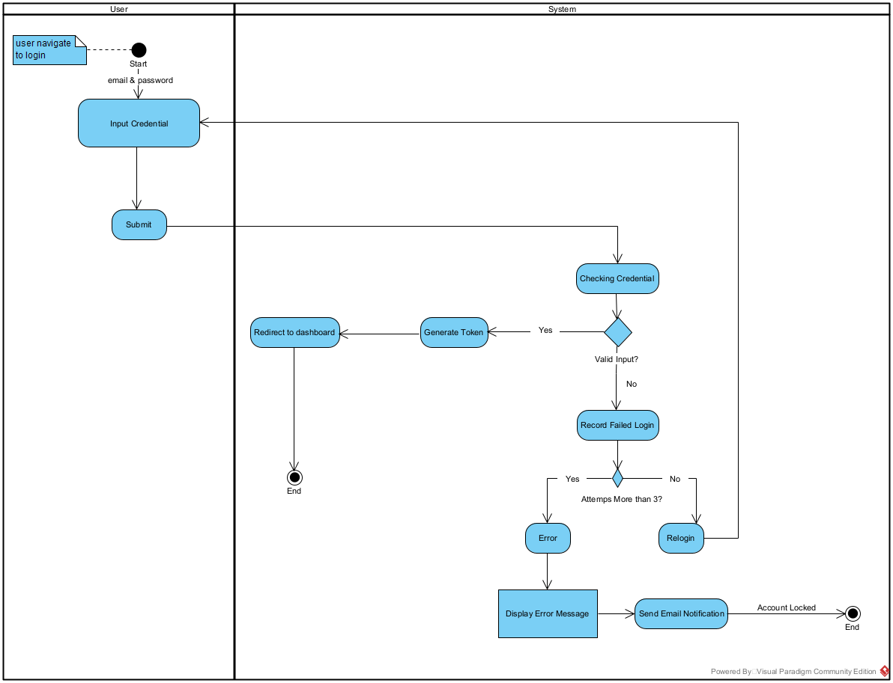

# RevoU Bank - Banking System Application

## Overview

RevoU Bank is a comprehensive banking system application developed as part of the RevoU Full-Stack Software Engineering program. This application provides a secure and efficient platform for managing banking operations including user authentication, account management, and various transaction types (deposits, withdrawals, and transfers).

The system is built with a focus on security, data integrity, and user experience, implementing industry best practices for financial applications.

## Features

### User Management
- Secure user registration and authentication
- Password hashing with bcrypt
- JWT-based authentication system
- User profile management

### Account Management
- Multiple account types support
- Unique account number generation
- Balance tracking and management
- Account details viewing

### Transaction Processing
- Deposits: Add funds to accounts
- Withdrawals: Remove funds from accounts
- Transfers: Move funds between accounts
- Transaction history and reporting

### Security
- Secure password storage with bcrypt
- API authentication middleware
- Request ID tracking for all API requests
- Database transaction integrity

## Tech Stack

### Backend
- **Python 3.11+**: Core programming language
- **Flask**: Web framework for building the API
- **SQLAlchemy**: ORM for database operations
- **PostgreSQL**: Database for persistent storage
- **Pydantic**: Data validation and settings management
- **Bcrypt**: Password hashing

### Frontend
- **HTML/CSS**: Basic UI templates
- **Jinja2**: Template engine for Flask

### Development Tools
- **Taskipy**: Task runner for development workflows
- **Pytest**: Testing framework

## Role & Responsibilities

As the developer of this project, my responsibilities included:

- Designing and implementing the database schema
- Developing RESTful API endpoints for all banking operations
- Implementing secure authentication and authorization mechanisms
- Creating data models and repositories for business logic
- Setting up transaction processing with proper error handling
- Ensuring data integrity and security throughout the application
- Implementing unit and integration tests
- Documenting the application architecture and API endpoints

## Activity Diagrams

The following activity diagrams illustrate the key workflows in the application:

### 1. Login Process


### 2. Withdrawal Process


### 3. Deposit Process


### 4. Transfer Process


## Getting Started

### Prerequisites
- Python 3.11 or higher
- PostgreSQL database

### Installation

1. Clone the repository
2. Install dependencies:
   ```
   pip install -e .
   ```
   or
   ```
   uv add flask_sqlalchemy
   ```

### Running the Application

```
flask --app app --debug run
```

or using taskipy:

```
taskipy fr
```

## Testing

Run tests using pytest:

```
pytest
```

## Database Schema

The application uses a relational database with the following main tables:
- Users: Stores user authentication and profile information
- Accounts: Manages account details and balances
- Transactions: Records all financial transactions with detailed metadata

## API Endpoints

The application provides RESTful API endpoints for all operations:

- `/api/v1/auth/login`: User authentication
- `/api/v1/transactions/deposit`: Process deposits
- `/api/v1/transactions/withdraw`: Process withdrawals
- `/api/v1/transactions/transfer`: Process transfers

Additional endpoints are available for user management, account operations, and transaction history.